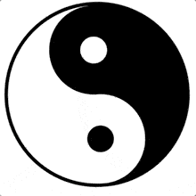

## 第 3 期 - 简写的 border-radius 100% 和 50% 是等效的 {docsify-ignore-all}

## 视频讲解
<iframe class="article-video" src="//player.bilibili.com/player.html?aid=81684736&cid=139770298&page=1" scrolling="no" border="0" frameborder="no" framespacing="0" allowfullscreen="true"> </iframe>

## 文字讲解

### 1、先讲结论

`border-radius` 这个 css 属性大家应该使用得非常娴熟，现实中用到的场景基本都是四个圆角一致的情况。

比如实现一个圆形按钮，其中 `border-radius` 数值有些人写为 `50%`，有些人则写成 `100%`，不过你会发现两者效果是一样的：


> 测试 HTML 代码如下：
```html
<style>
  .circle-btn {
    color: white;
    width: 100px;
    height: 100px;
    text-align: center;
    line-height: 100px;
  }
</style>

<div class="circle-btn" style="
    background: #8BC34A;
    border-radius: 100%;
">50%</div>

<div class="circle-btn" style="
    background: #E91E63;
    border-radius: 100%;
">100%</div>
```

其实不仅是 `50%`、`100%`，你将 `border-radius` 设置成 `x%`，只要 `x >= 50` 都能获得和 `50%` 一样的效果。

想进一步知道原因的话，可以继续往下看。

### 2、原因分析

这就要从 `border-radius` 的标准说起，在 `border-radius` 中

为了方便


### 3、小练习

最近看到使用一个 div + `border-radius` 实现以下 “转动的太极图”，大伙儿可以练习一下：



具体实现可参考以下任意一篇文章：
 - [How to create a yin-yang symbol with pure CSS](https://blog.logrocket.com/how-to-create-yin-yang-symbol-pure-css/)：使用一个 div 元素纯 CSS 实现 “阴阳” 圆形，附 [源码](https://codepen.io/boycgit/pen/YzPEEqm)
 - [利用CSS3的border-radius绘制太极及爱心图案示例](http://www.word666.com/wangye/90992.html)：使用 border-radius 绘制太极和爱心
 - [CSS画各种图形（五角星、吃豆人、太极图等）](https://www.imooc.com/article/256689)：更多练手的 css 项目

> 也可以参考我所 [“抄写” 的代码](https://github.com/boycgit/fe-program-tips/blob/master/src/3-border-radius/yinyang.html)


### 4、参考文章

 - [MDN border-radius](https://developer.mozilla.org/zh-CN/docs/Web/CSS/border-radius): MDN 文档
 - [Spec border-radius](https://drafts.csswg.org/css-backgrounds-3/#border-radius): CSS3 中 border-radius 的规范
 - [秋月何时了，CSS3 border-radius知多少？](https://www.zhangxinxu.com/wordpress/2015/11/css3-border-radius-tips/)：张鑫旭教程，行文幽默，讲解清晰详细
 - [了解 border-radius 的原理](https://blog.csdn.net/xiaoermingn/article/details/53497607)：用例子讲解 border-radius 的原理
 - [CSS border-radius:50%和100%的区别](https://blog.csdn.net/chy555chy/article/details/54783186)：本文主要是讨论 50% 和 100% 的设置值一样的原因
 - [Fancy-Border-Radius](https://9elements.github.io/fancy-border-radius/)：强大的在线 border radius 工具，所见即所得的；边动手边学习，理解会快很多
 - [border-radius](https://border-radius.com/)：专门生成 border-radius CSS3 代码的网站，也是所见即所得
