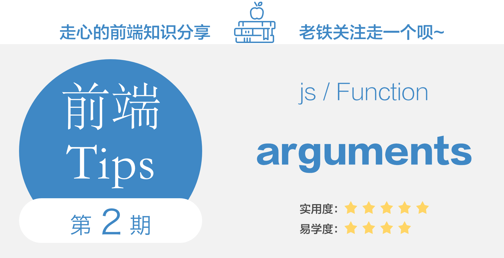

## 第 2 期 - 将 arguments 转换成数组的最佳实践 {docsify-ignore-all}

## 视频讲解
<iframe class="article-video" src="//player.bilibili.com/player.html?aid=80554200&cid=137855798&page=1" scrolling="no" border="0" frameborder="no" framespacing="0" allowfullscreen="true"> </iframe>

## 文字内容

### 先讲结论

如果你想将 arguments 转换成数组，最好的方式是使用 **rest** 参数转换的方式（即使用 `...` spread 操作符）。

想知道为什么的话，可以继续往下看。

### 1、本期 Tip 内容

`arguments` 对象是所有（非箭头）函数中都可用的局部变量，它是一个 “Array-Like” 对象，即 “像数组的对象”的意思，有些文章中也会翻译成 “伪数组对象”。（可以按索引取值、具有 `length` 属性，但不一定具备数组 `push`、`concat` 等方法，具体可参考文章[伪数组(ArrayLike)](https://segmentfault.com/a/1190000015285969)内容）

!> 注意：**箭头函数中并不存在 `arguments` 对象**

本期 tip 并不去详细讲 arguments 对象的知识内容（具体知识内容可阅读本讲末尾的参考文章），本讲着重讲解把它转换成数组时的最佳实践。

浏览了许多技术文章，将 `arguments` 对象转换成数组基本是 4 种方式：

 1. 使用 `Array.prototype.slice.call(arguments)`进行转换，或者是使用等效方法 `[].slice.call(arguments)`;
 2. 使用 `Array.from(arguments)` 进行转换
 3. 使用 `for` 循环挨个将 `arguments` 对象中的内容复制给新数组中
 4. 利用 ES6 中的 rest 参数转换，`let a = (...args) => args`;

大多数文章也仅仅是讲到这里为止，并没有继续讨论以上哪种方式最优。

接下来我们就用基准测试（Benchmark）的方式来量化上述那种方式性能更好。

### 2、性能测试

在《[做好准备：新的V8即将发布，Node 的性能正在改变](https://www.zcfy.cc/article/get-ready-a-new-v8-is-coming-node-js-performance-is-changing)》文中给了结论：

我将这文中提及的测试代码扔到 `jsPerf` 网站上（测试地址：https://jsperf.com/rest-arguments-slice ），运行结果如下：

图中数值越高代表性能越好，以上两幅图所反映的结果是一致的：
 1. 利用 ES6 中的 rest 参数转换性能最好
 2. 其次使用 `for` 循环方式转换
 3. `[].slice` 的方式性能较弱
 4. 最差的就是用 `Array.from` 进行转换

> 也可本地进行性能测试，测试代码在 [这儿](https://github.com/boycgit/fe-program-tips/blob/master/src/2-arguments/benchmark.js) 获取；源码来自 [官方提供的 benchmark 示例](https://github.com/davidmarkclements/v8-perf/blob/master/bench/arguments.js)

因此，如果你想要将 `arguments` 转换成数组，那么毫无疑问应当使用 ES6 中的 rest 参数转换方式。

除了性能更好之外，`rest` 参数的用法相对于直接使用 `arguments` 还有如下优点：
1. 箭头函数和普通函数都可以使用。
2. 更加灵活，接收参数的数量完全自定义。
3. 可读性更好，参数都是在函数括号中定义的，不会突然出现一个arguments，显得很突兀。

### Q & A

在这里我简单解答一些常见的疑惑：

Q: **为什么需要将 `arguments` 对象转换成数组？**
A: 答案也简单，因为 Array 实例提供了很多数组方法，比如 `.push`、`.concat` 等，提供了更多数据操作方式，转换成数组就是为了方便操作入参数据。

Q: **既然经常要将 `arguments` 转换成数组，为什么最初不把 `arguments` 设计成数组格式呢？**
A: 按照文章 《[JavaScript arguments 对象全面介绍](https://zhuanlan.zhihu.com/p/23007032)》所言， `arguments` 在语言的早期就引入了，当时的 Array 对象具有 4 个方法： `toString`、 `join`、 `reverse` 和 `sort`。`arguments` 继承于 Object 的很大原因是不需要这四个方法。（当时设计的人也不知道后续的发展会对 `arguments` 有这方面的强需求...变化无处不在..）

Q: **为什么需要 `Array-Like` 对象（伪数组对象）的存在？**
A: 前面说了，转换成数组也是为了提供更多数据操作方式；其实 `Array-Like` 对象的存在，其实也是为了给数据提供更多的操作方式，因为可以在对象上可以挂载很多 **自定义** 的操作方法，使用起来灵活度会很高。

Q: **上述讨论的数组转换结果，是否也适应于其他 “伪数组对象”？**
A: 因为 `arguments` 也是“伪数组对象”，不难推而广之，上面讨论的数组转换的方式都可以应用在“伪数组对象”上；至于每个转换方法的性能如何，我因为没有单独去测试过，所以也不能妄下定论，大家可以自己写 benchmark 去测试一下（个人猜测应该结论也差不多）。

### 3、参考文章

 - [做好准备：新的V8即将发布，Node 的性能正在改变](https://www.zcfy.cc/article/get-ready-a-new-v8-is-coming-node-js-performance-is-changing)：官方译文，V8 团队新的 JIT 编译器Turbofan 中很多以往的性能问题都获得了解决，推荐阅读；
 - [V8 性能优化杀手](https://juejin.im/post/5959edfc5188250d83241399)：这篇文章过时了，文中性能优化建议是针对 V8 上一代编译器；之所以还陈列在这儿，是为了方便和上一条参考文章做对比阅读，加深对新 V8 引擎优化的了解。
 - [arguments is special](https://mythbusters.js.org/#/array/arguments)：arguments 这个变量是特殊的，使用的时候需要多加注意
 - [JavaScript arguments 对象全面介绍](https://zhuanlan.zhihu.com/p/23007032)：非常全面的介绍，介绍了它的来历、注意事项
 - [JavaScript深入之类数组对象与arguments](https://github.com/mqyqingfeng/Blog/issues/14): 本文详细讲解了类数组和 arguments 对象
 - [伪数组(ArrayLike)](https://segmentfault.com/a/1190000015285969)：简要介绍了类数组对象的概念和转换；
 - [JavaScript: arguments leak var array.slice.call?](https://stackoverflow.com/questions/33162534/javascript-arguments-leak-var-array-slice-call)： v8 无法优化 slice 方法的原因，是因为该方法会保持对 arguments 对象的引用，无法将其优化成 stack 变量。
 - [Array-Like Objects and Generic Methods](http://speakingjs.com/es5/ch17.html#array-like_objects)：犀牛书中对 “伪数组” 概念的解释
 - [Arraylike的7种实现](https://www.cnblogs.com/silin6/p/ArrayLike.html): 罗列了原生的伪数组列表，同时说明了伪数组出现的缘故 —— 它的出现为一组数据的行为（函数）扩展提供了基础
 - [JavaScript类数组对象参考](https://blog.csdn.net/hztgcl1986/article/details/9203389)：JS 中有哪些伪数组对象？本文给了非常详细的讲解
 - [如何创建伪数组](https://stackoverflow.com/questions/6599071/array-like-objects-in-javascript)：stackoverflow 上关于如何创建伪数组的讨论
 - [JS Array From an Array-Like Object](https://dzone.com/articles/js-array-from-an-array-like-object)：本文罗列了将 Array-Like 对象转换成数组的方法，基本就是和本 tip 中罗列的方式差不多
 - [ES6 系列之箭头函数](https://segmentfault.com/a/1190000015162781)：本篇重点比较一下箭头函数与普通函数，比较全面
 - [详解箭头函数和普通函数的区别以及箭头函数的注意事项、不适用场景](https://juejin.im/post/5c76972af265da2dc4538b64)：本文这篇文章中还讲了很多 rest 参数的优点
