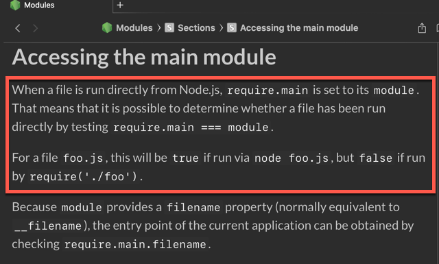
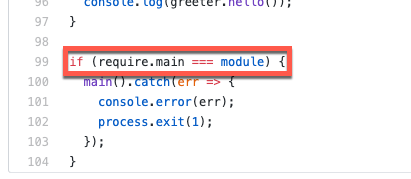

## 第 1 期 - `require.main === module`的使用 {docsify-ignore-all}

## 视频讲解
<iframe class="article-video" src="//player.bilibili.com/player.html?aid=80554200&cid=137855798&page=1" scrolling="no" border="0" frameborder="no" framespacing="0" allowfullscreen="true"> </iframe>

## 文字讲解
### 1、本期 Tip 内容
今天要学习的是 **Node.js** 的 tips，是关于 `require.main === module` 这个条件判断语句的用处。

先了解两个前提知识：
 1. 当 Node.js 直接运行一个文件时，`require.main` 会被设为该文件模块的 `module`变量。 
 2. 在每个模块里面， `module` 表示指向当前模块的变量对象（可以理解成某种意义上的 `this` 变量）；注意 `module` 并不是全局对象，是局部变量。

这意味着可以通过 `require.main === module` 来判断一个文件是否被直接运行。


Node.js 官网 “[Accessing the main module](https://nodejs.org/api/modules.html#modules_accessing_the_main_module)” 中有言：



简单翻译一下就是：
**可以通过 `require.main === module` 来判断当前文件是否直接被 node.js 执行，比如对 `foo.js` 文件，如果你执行了 `node foo.js`，那么这个条件语句结果是 `true`，如果是被其他文件以 `require('./foo')` 引用则为 `false`**

### 2、简单的例子
我们写一个简单的例子来理解，比如我们写一个 `plus.js` 文件，里面提供了 `plus` 函数来实现 **加法** 的功能：

```js
// plus.js
function plus(a, b) {
    return a + b;
}

module.exports = plus;
```

我们想要快速简单测试该 `plus` 功能，所以添加一行测试语句放在文末：

```js
// plus.js
...
module.exports = plus;
// 新增一行语句测试 plus 函数功能
console.log('plus: 1 + 2 = ', plus(1, 2));
```

此时我们直接执行 `node plus.js` 的确会输出 `plus: 1 + 2 =  3` 语句，达到我们测试的目的。

不过这样会存在存在一个问题，当正常情况下我们另一个模块 `main.js` 去引入该 `plus.js` 文件后，我们去执行 `main.js` 文件也会执行这条测试代码 —— 很显然这不是我们所想要的。

此时这个 `require.main === module` 判断语句就派上用场了：

```js
// plus.js
...
module.exports = plus;
// 使用该判断语句
if(require.main === module) {
    console.log('plus: 1 + 2 = ', plus(1, 2));
}
```

这样其他模块引入当前 `plus.js` 模块后就不会执行这条测试语句了。

> 本例代码可前往 [这儿](https://github.com/boycgit/fe-program-tips/blob/master/src/1-require.main/plus.js) 获取


该技巧经常用在代码演示中（或者自测），比如我最近正在看 [loopback-next/context example 代码](https://github.com/strongloop/loopback-next/blob/master/examples/context/src/) 中的每个 js 文件文末最后都会有这样的代码：



这就是为了方便测试该模块功能，同时也不影响被其他模块引用。


### 3、参考文章
 - [require.main](https://nodejs.org/api/modules.html#modules_require_main)：官方文档对 require.main 的解释
 - [Node.js, require.main === module](https://stackoverflow.com/questions/45136831/node-js-require-main-module)：如果想直接在 node.js 中运行代码，一般用这个条件


